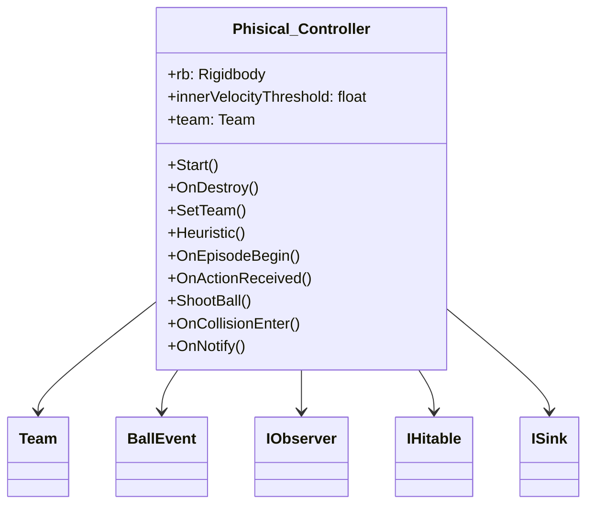
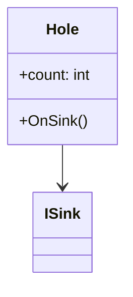
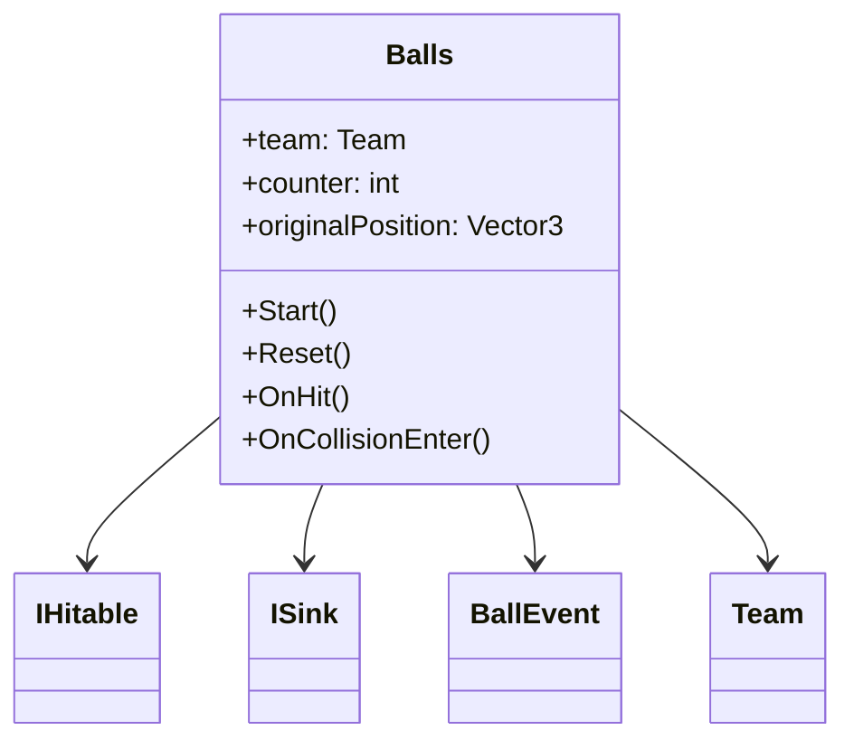
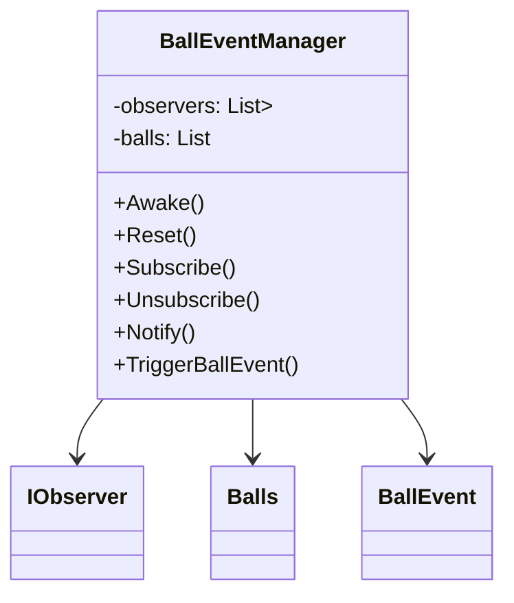

# RL Billiard Unity Project Documentation

## Table of Contents
- [Overview](#overview)
- [Agent: Phisical_Controller](#phisical_controller)
- [Sink: Hole](#hole)
- [Balls](#balls)
- [BallEventManager](#balleventmanager)
- [GitHub Repository](#github-repository)

## Overview
The RL Billiard Unity project is a reinforcement learning (RL) implementation within the context of a billiards game using the Unity game development engine. The primary focus is on training an intelligent agent, represented by the `Phisical_Controller` class, to play billiards autonomously through interactions with its environment. The environment includes billiard balls (`Balls` class), a sink (`Hole` class), and an event manager (`BallEventManager` class) to handle ball-related events.

Key features and components of the RL Billiard Unity project include:

1. **Agent (`Phisical_Controller`):**
   - The `Phisical_Controller` class represents the intelligent agent responsible for learning to play billiards.
   - It subscribes to ball events, observes its environment, and takes actions using reinforcement learning techniques.

2. **Environment:**
   - Billiard balls are represented by the `Balls` class, which includes properties such as team affiliation and hit counts.
   - The `Hole` class serves as a sink for balls, triggering events when a ball is successfully hit into it.

3. **Event Management:**
   - The `BallEventManager` class manages ball-related events, such as notifying observers when a ball is hit or resetting the state of the balls.
   - It uses the observer and singleton patterns to notify other classes, such as the `Phisical_Controller`, about relevant events.

4. **Reinforcement Learning:**
   - The `Phisical_Controller` class implements reinforcement learning techniques to learn how to shoot billiard balls effectively.
   - It receives rewards and penalties based on its actions and the outcomes of those actions, facilitating the learning process.

Overall, the RL Billiard Unity project aims to demonstrate the application of reinforcement learning in a gaming environment, specifically in the context of playing billiards. The intelligent agent learns to make decisions and take actions by interacting with the billiard balls and sink, with the goal of optimizing its gameplay over time.

## Phisical_Controller
```csharp
using UnityEngine;
using Unity.MLAgents;
using Unity.MLAgents.Sensors;
using Unity.MLAgents.Actuators;
using System;

public class Phisical_Controller : Agent, IObserver<BallEvent>
{
    [SerializeField] Rigidbody rb;
    [SerializeField] float innerVelocityThreshold = 0.1f;

    public Team team = Team.none;

    private void Start()
    {
        BallEventManager.Instance.Subscribe(this);
    }

    private void OnDestroy()
    {
        BallEventManager.Instance.Unsubscribe(this);
    }

    private void SetTeam(object sender, BallEvent e)
    {
        if ((e.team == Team.none) || (e.team == Team.Both))
        {
            return;
        }
        else if (team == Team.Striped || team == Team.Full){
            return;
        }
        this.team = e.team;
    }

    // Implement the Heuristic method for manual control during training
    public override void Heuristic(in ActionBuffers actionsOut)
    {
        var continuousActionsOut = actionsOut.ContinuousActions;
        continuousActionsOut[0] = Input.GetAxisRaw("Horizontal");
        continuousActionsOut[1] = Input.GetAxisRaw("Vertical");
    }

    public override void OnEpisodeBegin()
    {
        // Reset relevant variables at the beginning of each episode
        team = Team.none;
        BallEventManager.Instance.Reset();
    }

    public override void OnActionReceived(ActionBuffers actions)
    {
        // Extract direction and force from actions
        float direction = actions.ContinuousActions[0];
        float force = actions.ContinuousActions[1];

        ShootBall(direction, force);
    }


    void ShootBall(float direction, float force)
    {
        

        // Check the inner velocity
        if (rb.velocity.magnitude <= innerVelocityThreshold)
        {
            // Convert the direction from degrees to radians
            float radian = direction * Mathf.Deg2Rad;

            // Calculate the horizontal and vertical force components
            float horizontalForce = Mathf.Cos(radian) * force * 1000;
            float verticalForce = Mathf.Sin(radian) * force * 1000;

            // Apply the forces to shoot the ball
            rb.AddForce(new Vector3(horizontalForce, 0, verticalForce));
        }
    }
    

    private void OnCollisionEnter(Collision collision)
    {
        IHitable hitable = collision.gameObject.GetComponent<IHitable>();
        if (hitable != null)
        {
            hitable.OnHit();
            //a little reward for hitting any balls
            AddReward(+0.01f);
        }
    }

    public void OnNotify(object sender, BallEvent e)
    {
        if (team == Team.none)
        {
            // Set the team of the Ai for the first ball that was hit down first
            SetTeam(sender, e);
        }

        if (e.team == this.team)
        {
            // Add reward for hitting the right balls
            AddReward(1f);
        }
        else if (e.team == Team.Both)
        {
            // Add penalty for hitting down the Black or White balls
            AddReward(-10f);
            Debug.Log("Episode end");
            EndEpisode();
        }
        else
        {
            // Add penalty for hitting the wrong team's balls
            AddReward(-1f);
        }
    }
}

```
**Phisical_Controller Class Diagram:**


## Hole
```csharp
using System.Collections;
using System.Collections.Generic;
using UnityEngine;
using System;

public class Hole : MonoBehaviour, ISink
{

    //counter for how many balls were hit down the hole for tensorboard
    int count = 0;
    
    public void OnSink(Balls ball)
    {
        BallEventManager.Instance.TriggerBallEvent(ball.team);

        if(ball.TryGetComponent(out Phisical_Controller controller))
        {
            return;
        }
        if(ball.team == Team.Both)
        {
            return;
        }
        ball.gameObject.SetActive(false);
        count++;
    }

}

```
**Hole Class Diagram:**


## Balls
```csharp
using System;
using System.Collections;
using System.Collections.Generic;
using UnityEngine;

public class Balls : MonoBehaviour, IHitable
{
    public Team team;

    //counter counts how many times the ball has been hit for tensor board
    int counter = 0;

    public void OnHit()
    {
        counter++;
    }


    public Vector3 originalPosition;

    private void Start() {
        originalPosition = new Vector3(transform.position.x,transform.position.y,transform.position.z);
    }
    public void Reset()
    {
        GetComponent<Rigidbody>().velocity = Vector3.zero;
        transform.position = originalPosition;
        gameObject.SetActive(true);
    }

    private void OnCollisionEnter(Collision other) {
        if(other.gameObject.TryGetComponent(out ISink sink)){
            
            sink.OnSink(this);
        }
    }
}

public class BallEvent : EventArgs
{
    public Team team;

    public BallEvent(Team team)
    {
        this.team = team;
    }
}

public enum Team{
    Full,
    Striped,
    none,
    Both    
} 

```
**Balls Class Diagram:**


## BallEventManager
```csharp
// Paste BallEventManager code here
```
**BallEventManager Class Diagram:**


## GitHub Repository
[RL_Billiard GitHub Repository](https://github.com/FakanBalint/RL_Biliard)
```
